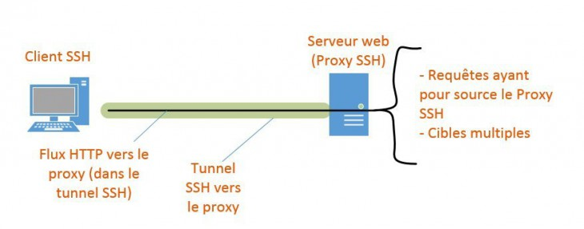

# SSH (Secure SHell)

## Basic connection

    ssh user@ip

> ssh user@192.168.0.46

## File transfert

    scp [user@ip:]/full/file/path/src [user@ip:]/full/folder/path/dst

```shell
# Upload (From local -> remote)
$ scp /home/mickael/data/Ficher2 root@192.168.10.131:/var/www/
# Download (From remote -> to local)
$ scp root@192.168.10.131:/var/www/Fichier2 /home/mickael/data/
```

## Recurcive copies

    scp -r [user@ip:]/full/root?folder/path/src [user@ip:]/full/folder/path/dst

> scp -r /home/mickael/data/ root@192.168.10.131:/var/www/

## X11 Forwarding


- On server

- In file `/etc/ssh/sshd_config`

```shell
X11Forwarding yes
X11DisplayOffset 10
```

*NOTE* Do not forget to reboot

> service sshd restart

*in progress*

## Tunneling 

We are going to match a local port of our machine to a remote port of the machine to which we are connecting, all through our SSH connection:

```shell
$ ssh -f user@monserveur -L 2500:localhost:80 -N
```

- `-f` to put command in foreground
- `-L` define *pathfinder* `local_port:target_tunnel_output:target_port_output_tunnel"
- `-N` Do not execute e re;ote command

For `-L`, here, the local port 2500 will represent the port 80 of ther remote.

Multiple SSH tunnels can be established at the same time, as long as they don't forward (match) the same ports. For example, here I have an active tunnel on my local port 2500, I can establish a second one on port 2501, to establish a connection with my local STMP server:

```shell
$ ssh -f mickael@1.2.3.4 -L 2501:192.168.1.10:25 -N
```

## Proxy SSH



```shell
$ ssh -D 12345 mickael@monserveur
```

## Port knocking


Use tools `knockd`

```shell
$ apt install knockd
```

Update config. file

- /etc/knockd.conf
```ini
[ouvrir_SSH]

sequence = 2005,1905,3005

seq_timeout = 20 command = /sbin/iptables -I INPUT -s %IP% -p tcp --dport 22 -j ACCEPT tcpflags = syn

[fermer_SSH]

sequence = 3005,1905,2005

seq_timeout = 20

command = /sbin/iptables -D INPUT -s %IP% -p tcp --dport 22 -j ACCEPT tcpflags = syn
```

**IMPORTANT** 

Your server must have closed all unused ports beforehand. More simply with the command 

    iptables -P INPUT DROP

which will have the effect of closing all the input ports. Be careful with this command all the same if you don't want to cut off your own access.

## Ref.

- [Comprendre et maîtriser SSH](https://www.it-connect.fr/cours/comprendre-et-maitriser-ssh/)