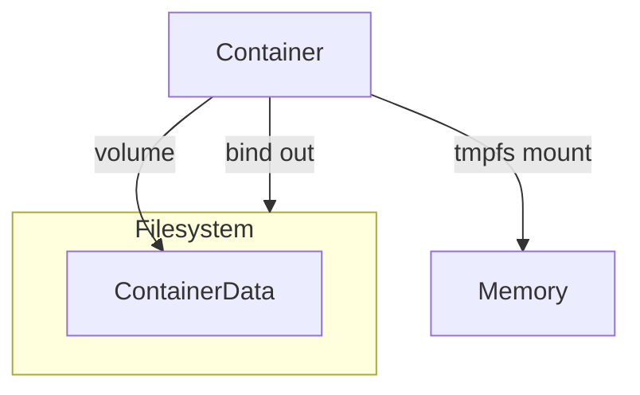

# Docker

[TOC]

```bash
docker images # list images
docker pull  # pull a certain image
docker run -it  <command> # run a command in a new container (interactively)

docker ps -as # list all containers
docker exec -it <container-id> <command> # run a command in a running container
docker container prune # delete all containers
docker inspect <container-id> # show low-level info on a container
docker commit <container-id> <repository:tag> # create a new image from container changes

# Networks managing: None, Host, Bridge (default)
docker network create --driver <driver> --subnet x.x.x.x/x --gateway x.x.x.x <network-name> # create a new network
docker network connect <network-name> <container-id> [--ip x.x.x.x] # connect a container to a network (and changing the default ip)
docker rmi $(docker images|grep none|awk '{ print $3 }') # remove docker images with tag or name at none
```


## Docker volumes




```bash
docker volume create <volume-name> # create a volume
docker inspect <volume-name> # to get the mount point on the host
```


```bash
docker run -itd --mount src=<volume-name>,target=/some/path --name <container-name-to-create> --rm <image-name> # mount a volume on the container
```


## Manage image size

```bash
docker image history <image-name> -notrunc # know the size and layers of an image
```

[Multi-stage Build](./Dockerfile/index.md): allows to reduce the final size of a docker image by performing some operations before creating the final image (e.g. compiling the source code)

Choose your base image:

- alpine
- debian
- scratch
- busybox:glibc (useful if the program is dynamic)

`C_GO_ENABLED=0`: Go doesn't use system libraries anymore but its own implementations so it becomes static (`net` and `dns` for example)

Alpine uses musl but there is the possibility to install build-base

The others use glibc. The 2 are not compatible (i.e. compiling on glibc and running on alpine will not work)

## Docker Forensic

- Dive: exploring image, layer, contents

- LiME: Linux Memory Extractor

# Docker-compose

```bash
docker-compose up --build -d # run, build and keep detach
docker-compose stop/down
```


# To get further

- [Kubernetes](../kubernetes/index.md)
- Skaffold
- Kustomize
