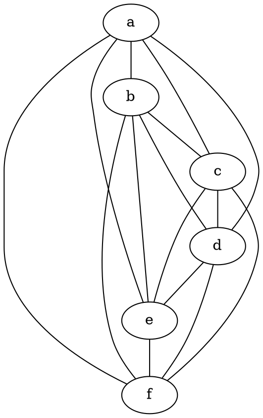
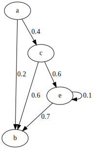

# GraphViz

## Simple command

-  With `graphiviz` python module

```python
import graphviz

dot_data = """
// The Round Table
digraph {
    A [label="King Arthur"]
    B [label="Sir Bedevere the Wise"]
    L [label="Sir Lancelot the Brave"]
    A -> B
    A -> L
    B -> L [constraint=false]
}
"""
graph = graphviz.Source(dot_data)
graph
```
  


- With command line


```python
!dot -Tpng ./assets/source.dot -o ./assets/source.png
```


## Some examples

## Basic

- graph

No direction

```text
graph {
  hello -- world;
}
```


- digraph

oriented graph

```text
graph {
  hello -> world;
}
```


- digraph oriented AND edge in color

```text
digraph {
  rankdir=LR;
  
  hello [ label = "Hello" ];
  hello -> world [ color="orange", penwidth=3.0 ];
}
```


- digraph with font

```text
digraph {
  Tinos [ fontname="Tinos" ];
  Handlee [ fontname="Handlee" ];
  "Sedgwick Ave" [ fontname="Sedgwick Ave" ];
  "*also Sedgwick*";
}
```


- digraph custom edge

```text
digraph {
  node [ shape=square ];
  edge [ style=dashed ];
  
  see -> think -> do;
}
```


### Simple Graph


    

    
### Full digraph

```python
import graphviz

dot_data = """
digraph {
    a -> b[label="0.2",weight="0.2"];
    a -> c[label="0.4",weight="0.4"];
    c -> b[label="0.6",weight="0.6"];
    c -> e[label="0.6",weight="0.6"];
    e -> e[label="0.1",weight="0.1"];
    e -> b[label="0.7",weight="0.7"];
}
"""
graphviz.Source(dot_data)
```
    

    
### Showing A path

```python
import graphviz

dot_data = """
graph {
    a -- b[color=red,penwidth=3.0];
    b -- c;
    c -- d[color=red,penwidth=3.0];
    d -- e;
    e -- f;
    a -- d;
    b -- d[color=red,penwidth=3.0];
    c -- f[color=red,penwidth=3.0];
}
"""
graphviz.Source(dot_data)
```
    


### Subgraph

```python
import graphviz

dot_data = """
digraph {
    subgraph cluster_0 {
        label="Subgraph A";
        a -> b;
        b -> c;
        c -> d;
    }

    subgraph cluster_1 {
        label="Subgraph B";
        a -> f;
        f -> c;
    }
}
"""
graphviz.Source(dot_data)
```

### Complex digraph

```python
import graphviz

dot_data = """
digraph G {
    size ="4,4";
    main [shape=box]; /* this is a comment */
    main -> parse [weight=8];
    parse -> execute;
    main -> init [style=dotted];
    main -> cleanup;
    execute -> { make_string; printf}
    init -> make_string;
    edge [color=red]; // so is this
    main -> printf [style=bold,label="100 times"];
    make_string [label="make a\nstring"];
    node [shape=box,style=filled,color=".7 .3 1.0"];
    execute -> compare;
}
"""
graphviz.Source(dot_data)
```
   

    
### Complex label

```text
digraph G {
    a -> b -> c;
    b -> d;
    a [shape=polygon,sides=5,peripheries=3,color=lightblue,style=filled];
    c [shape=polygon,sides=4,skew=.4,label="hello world"]
    d [shape=invtriangle];
    e [shape=polygon,sides=4,distortion=.7];
}
```


### Advanced Graphs

#### Edge connection

Use `<angle-brackets>` to connect edge

```text
digraph {
  rankdir=LR;
  node [ shape=record ];

  struct1 [
      label = "a|b|<port1>c";
  ];
  
  struct2 [
      label = "a|{<port2>b1|b2}|c";
  ];
  
  struct1:port1 -> struct2:port2 [ label="xyz" ];
}
```


#### `Clusters` (or `subgraph`)

You can group related nodes by putting them in a subgraph whose name begins with `cluster_`.

```text
digraph {
  node [ fontname="Handlee" ];
  subgraph cluster_frontend {
    label="*Frontend*";
    React;
    Bootstrap;
  }
      
  subgraph cluster_backend {
    label="*Backend*";
    expressjs;
    "aws-sdk";
  }

  React -> expressjs;
  expressjs -> "aws-sdk";
}
```


